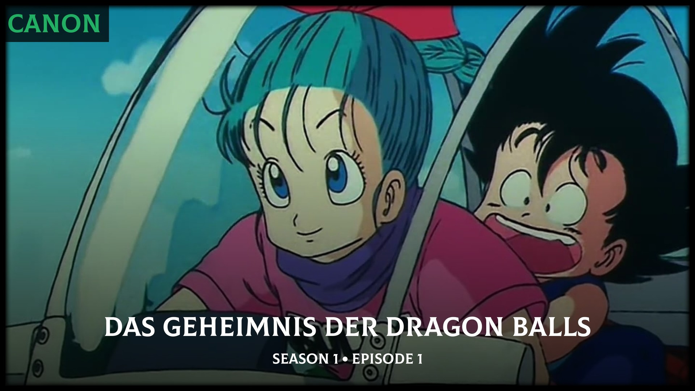
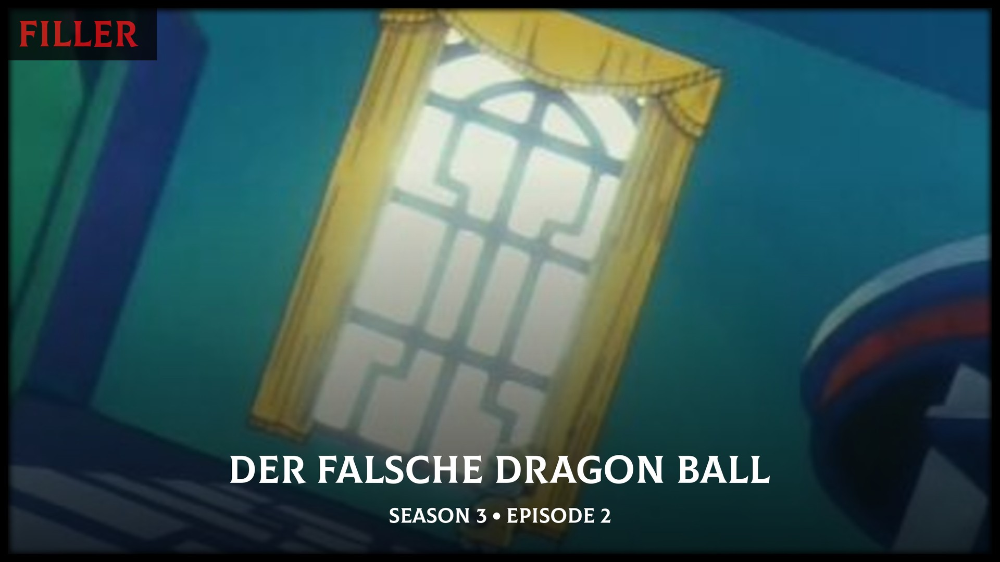
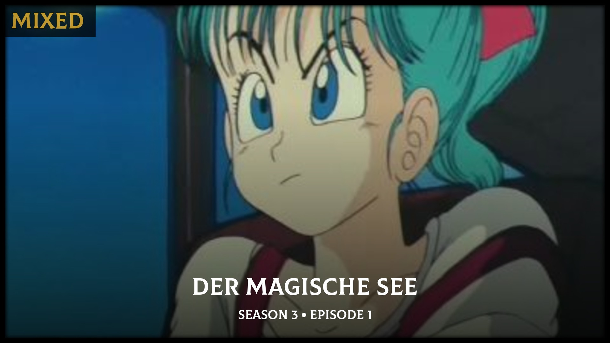

<p align="center">
  
</p>

**AniMetaFill** is a high-performance automation daemon designed to bridge the gap between Anime filler databases and Plex/Kometa. By leveraging surgical regex-based targeting, it classifies your anime library into **Canon**, **Filler**, and **Mixed** episodes without bloating your Plex metadata.

<p align="center">
    <a href="https://ko-fi.com/R6R81S6SC" target="_blank"></a><br />
</p>

---

## ✨ Why AniMetaFill?
Unlike traditional metadata agents that rely on Plex labels or tags (which can be messy and hard to manage), AniMetaFill generates **surgical `filepath.regex` overlays** for Kometa.

- **Zero Metadata Bloat**: No need to "tag" your media. The classification exists purely in the overlay layer.
- **Precision Matching**: Uses a 3-tier matching strategy (ID -> Title -> Fallback) to ensure your library is mapped accurately.
- **Set and Forget**: Runs as a daemon with a robust scheduler to keep your library updated as new episodes air.

---

## 🖼 Visual Examples (Default Config)

| Canon Episode | Filler Episode | Mixed Episode |
| :---: | :---: | :---: |
|  |  |  |

---
## 🛠 How It Works
AniMetaFill is a simple automation tool that handles the "boring stuff" of anime classification in 3 easy steps:

1.  **Scan**: It reads your Plex libraries to see what anime you have.
2.  **Match**: It talks to **Sonarr**, **SIMKL**, and **AFL** to find out which episodes are Canon or Filler.
3.  **Overlay**: It generates a transparent "surgical" list for **Kometa** to handle the posters automatically.

### Why this method?
- **No Manual Tagging**: You don't have to touch your Plex metadata or labels.
- **Accurate**: It uses TVDB IDs for a perfect match, falling back to smart searches if needed.
- **Always Fresh**: Since it runs as a daemon, it catches new episodes the moment they air.

---

## 🛠 Installation

### 🐳 Option 1: Docker (Recommended)
1. **Configure**: Copy `config.example.yml` to `config.yml` and fill in your credentials.
2. **Deploy**: Start the container using the template below. **Make sure to adjust the paths, user IDs, and networks to match your environment.**

```yaml
---
services:
  animetafill:
    hostname: "animetafill"
    container_name: "animetafill"
    environment:
      - "TZ=Europe/Berlin"
    user: "1000:1000"
    image: "ghcr.io/fscorrupt/animetafill:latest"
    restart: "unless-stopped"
    volumes:
      - "/opt/appdata/animetafill/config.yml:/app/config.yml:ro" # Mount your local config
      - "/opt/appdata/animetafill/data:/data:rw"               # Database and JSON export
      - "/opt/appdata/animetafill/data/kometa_overlays:/data/kometa_overlays:rw" # Generated overlay
      - "/opt/appdata/animetafill/logs:/app/logs:rw"
    networks:
      - "proxy"

networks:
  proxy:
    driver: bridge
    external: true
```

### 🐍 Option 2: Manual Installation
If you prefer to run the script directly on your host machine:

1.  **Clone the Repository**:
    ```bash
    git clone https://github.com/fscorrupt/AniMetaFill.git
    cd AniMetaFill
    ```

2.  **Install Dependencies**:
    ```bash
    pip install -r requirements.txt
    ```

3.  **Configure**:
    Copy `config.example.yml` to `config.yml` and fill in your credentials.

4.  **Run**:
    ```bash
    python -m app.main --now
    ```

---

## 🚀 CLI Commands
You can trigger AniMetaFill manually or force specific behaviors using the following flags:

- **Immediate Sync**: `python -m app.main --now`
  Triggers a synchronization run immediately, ignoring any schedules.
- **Force Re-sync**: `python -m app.main --force`
  Refreshes all marker data from providers, even if they were already synced.

---

## 📅 Scheduling & Daemon
AniMetaFill includes a built-in scheduler to keep your library in sync automatically.

### Configuration Options
In your `config.yml`, you can customize the run frequency:

- **Mode: `interval`**: Runs every X minutes (defined by `interval: 60`).
- **Mode: `daily`**: Runs at specific times every day.
  - *Multiple Times*: You can use comma-separated hours: `time: "02:00,05:00,08:00,11:00,14:00,17:00,20:00,23:00"`.
- **Mode: `weekly`**: Runs once a week on a specific day (e.g., `weekday: "mon"`).
- **Mode: `monthly`**: Runs once a month on a specific day (e.g., `day: 15`).

> [!TIP]
> Setting `run_on_startup: true` ensures that AniMetaFill performs a full sync immediately whenever the container or script starts, regardless of the next scheduled time.

---

## 🖇 Kometa Integration
Once AniMetaFill has completed its first sync, it will generate a unified `anime_overlays.yml` file. You must mount this file (or the parent directory) into your **Kometa** container and reference it in your Kometa `config.yml`.

### 1. Update Kometa Volumes
In your Kometa `docker-compose.yml`, mount the generated file:

| Host Path | Container Path |
| :--- | :--- |
| `/opt/appdata/animetafill/data/kometa_overlays/anime_overlays.yml` | `/config/anime_overlays.yml` |

```yaml
services:
  kometa:
    # ... other config ...
    volumes:
      - /opt/appdata/animetafill/data/kometa_overlays/anime_overlays.yml:/config/anime_overlays.yml
```

### 2. Reference in Kometa `config.yml`
Add the following to your Kometa configuration to apply the overlays to your Anime library:

```yaml
libraries:
  Anime:
    overlay_files:
    - file: config/anime_overlays.yml
```

---

## 🎨 Aesthetic Controls
AniMetaFill allows you to style your overlays directly in the `config.yml`. You can change:
- **Bar Color**: Use ARGB hex codes for transparency (e.g., `#000000BF`).
- **Typography**: Change the font size and color for Canon/Filler labels.
- **Alignment**: Support for `left`, `center`, and `right` positioning.

---


<p align="center">
  <i>Created with ❤️ for the Anime community.</i>
</p>
